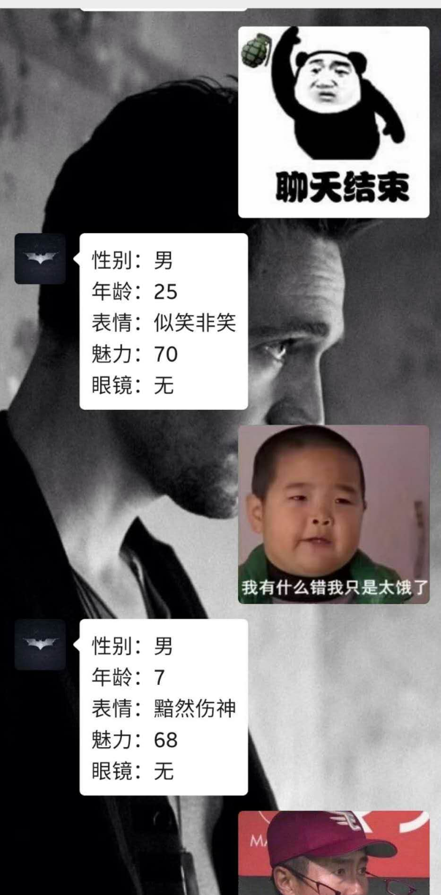

# 运行在树莓派4b上的微信公众号

## 1.基础配置
大体思路是利用ngrok将树莓派的80端口映射到公网（80端口为公众号的要求）,并在微信公众号开发者配置里添加服务器地址。同时在本地利用django和wechatpy搭建80端口的响应脚本，从而实现运行在树莓派4b上的微信公众号的目的。

### 1.1 使用的硬件
+ 树莓派4b( Raspbian GNU/Linux 10 (buster) )

### 1.2 使用的代码库
+ 基于python3( __version__= '3.7.3' )
+ wechatpy( __version__ = '1.8.11' )
+ django ( __version__ = '3.0.4' )

### 1.3 使用的内网映射软件
+ ngrok ([网址](https://ngrok.com/))

### 1.4 目前进度
+ 树莓派与公众号对接成功
+ 添加google翻译接口
+ 添加有道翻译接口
+ 添加[腾讯智能闲聊接口](https://ai.qq.com/doc/nlpchat.shtml)
+ 添加[腾讯人脸分析接口](https://ai.qq.com/doc/detectface.shtml)

## 2.使用方法
###2.1 启动django的相应脚本
+ 在wechat/config下添加相应的账号参数
+ 在wechat目录下输入：
```
sudo python3 manage.py runserver 80
```
后台运行：
```
nohup sudo python3 manage.py runserver 80 >>wechat.out 2>&1 &
```
更多信息可以参考[这篇文章](https://blog.csdn.net/qq_34621092/article/details/84957731)

###2.2 启动ngrok内网映射
ngrok配置教程可参考[官网](https://ngrok.com/)和[这篇文章](https://shumeipai.nxez.com/2014/01/04/the-raspberry-pi-using-ngrok-web-mapping-services-to-the-public-network.html)
+ 在ngrok的目录下输入：
```
ngrok http 80
```
得到输出
> Forwarding  http://abcdef.ngrok.com -> 127.0.0.1:80

得到的网址每个人不一样，将得到的网址填写到自己的公众号主页-开发-基本配置-服务器网址下。

+ 可以在公众号主页-开发-开发者工具里进行在线接口调试

## 3.一些效果图
+ 添加[腾讯智能闲聊接口](https://ai.qq.com/doc/nlpchat.shtml)的文字应答


+添加[腾讯人脸分析接口](https://ai.qq.com/doc/detectface.shtml)的人脸分析
